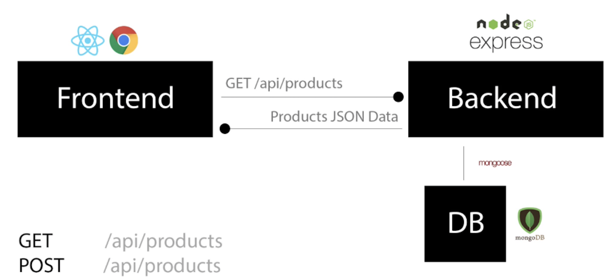
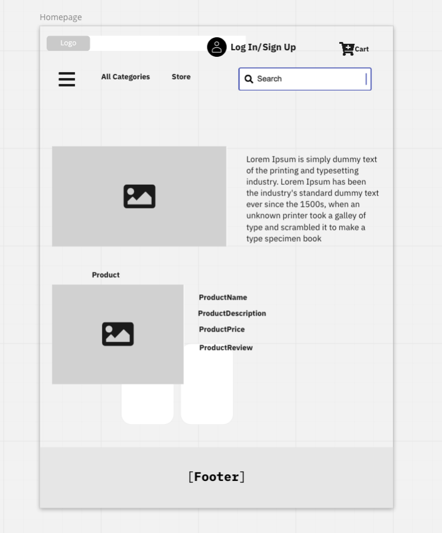

# AfricanBoutique

Ecommerce

## Build Single React Single Web Application

E-commerce for Small Local Business who want to grow but does not have a Website for their Products.A website that allows business owner to sell orignial African products over the internet. Through an African Boutique e-commerce website, a customer can view product price, add and remove to cart and process orders using credit card and view and rating system. Admin area to manage products, users, orders.

#### Project Status

This project is currently in developement

#### Technology used

- HTML5, CSS3, JavaScript, React, Express, MongoDB,..
  

#### Installation and Setup Instruction

Clone down this repository. You will need `node` and `npm` installed globally on your machine.

Installation:

`npm install`
To Start Server:
`npm start`
To install React Bootstrap:
`npm i react-bootstrap`

#### User Interface Design

- To design user inteface I use React Bootstrap for responsiviness in different screen size
- I started this process by using the `create-react-app` boilerplate.
- User interface Homepage Wireframe
- 
